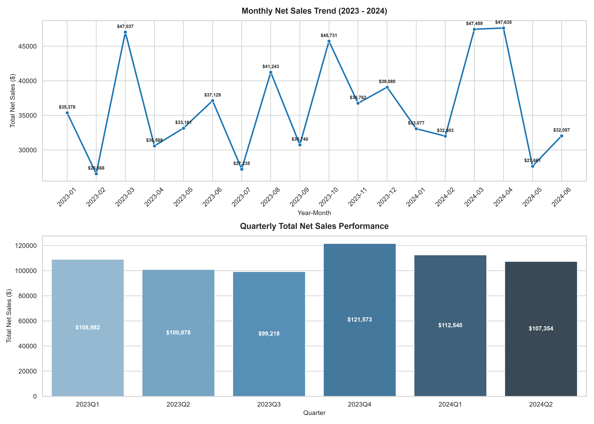
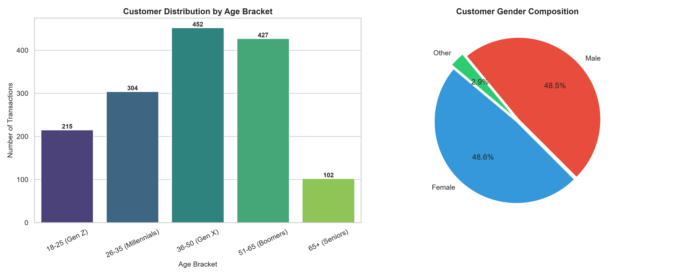
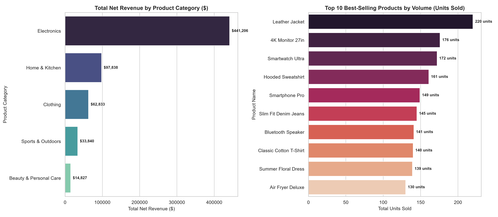
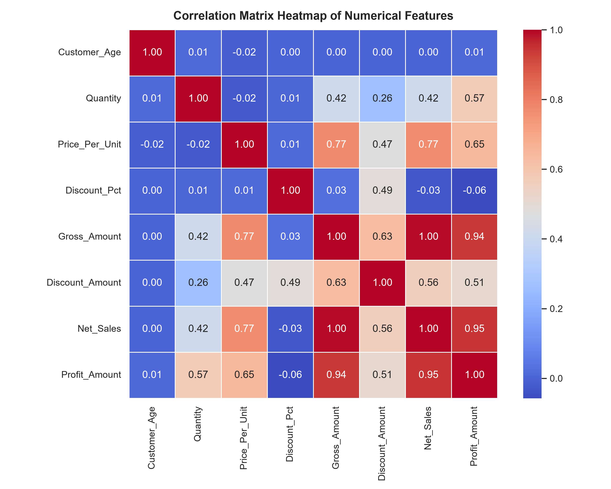
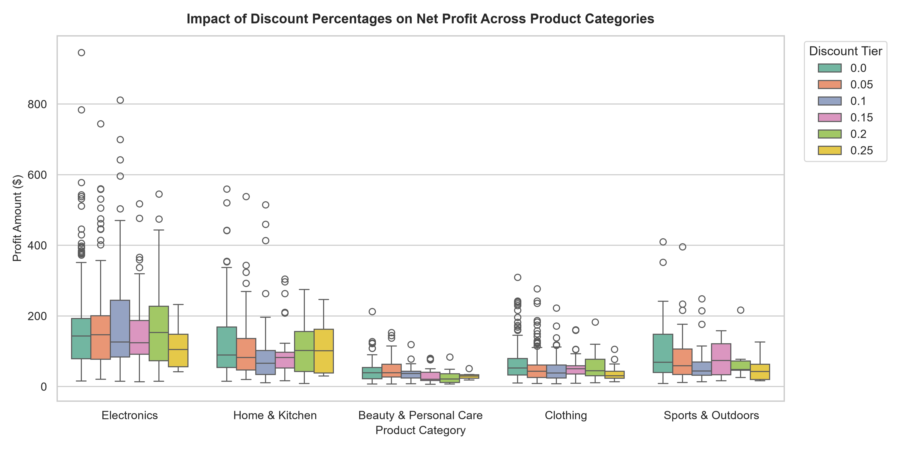

# 📊 Exploratory Data Analysis on Retail Sales Dataset

**Organization:** Oasis Infobyte (OIBSIP)  
**Track:** Data Analytics (Level 1 • Task 1)  
**Author:** Narendra

---

## 📌 Project Overview
This repository contains the complete Exploratory Data Analysis (EDA) on a comprehensive retail transaction dataset. The analysis explores transaction distributions, customer demographics, monthly & quarterly revenue seasonality, category performance, and the impact of promotional discounts on realized net profit margins.

---

## 📁 Repository Structure
```text
├── charts/
│   ├── monthly_and_quarterly_sales_trend.png
│   ├── customer_demographics_breakdown.png
│   ├── product_and_category_performance.png
│   ├── correlation_matrix_heatmap.png
│   └── discount_vs_profitability_by_category.png
├── data/
│   └── retail_sales_dataset.csv
├── notebooks/
│   └── retail_sales_eda.ipynb
├── report/
│   └── findings_and_recommendations.md
├── run_analysis.py
├── requirements.txt
└── README.md
```

---

## 📈 Visualizations & Key Charts

### 1. Revenue Trajectory (Monthly & Quarterly)


### 2. Customer Demographics Breakdown


### 3. Product & Category Performance


### 4. Correlation Matrix Heatmap


### 5. Discount vs. Realized Profitability


---

## 📄 Analytical Report
For the complete executive briefing, deep-dive statistics, and 4 actionable business recommendations, see **[report/findings_and_recommendations.md](report/findings_and_recommendations.md)**.

---

## 🚀 How to Run Locally
```bash
pip install -r requirements.txt
python run_analysis.py
jupyter notebook notebooks/retail_sales_eda.ipynb
```
